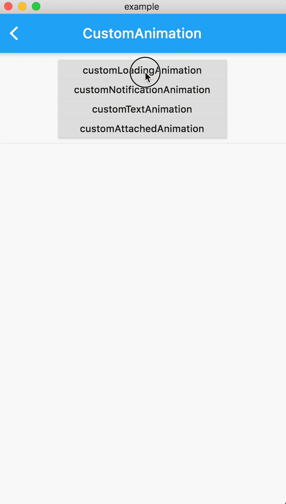

BotToast 🤖
========= 
A really easy to use flutter toast library!

[](https://pub.dev/packages/bot_toast)
[](https://github.com/MMMzq/bot_toast/actions)
[](https://codecov.io/gh/MMMzq/bot_toast)

### Language: English | [中文简体](README_zh.md)

* [🐲Overview](#Overview)
* [🐼Online Demo](#Online-Demo)
* [🐳Example](#Example)
* [🐺Renderings](#Renderings)
* [🐮Getting started](#Getting-started) 
* [🐼3.0 version](#30-version)
* [📃Documentation](#Documentation) 

###  🐲Overview

- In the true sense of Toast, you can call it whenever you need it, without any restrictions! 

- Feature-rich, support for displaying notifications, text, loading, attachments, etc. Toast

- Support for popping up various custom Toasts, or you can pop up any Widget as long as it meets the requirements of the flutter code.

- API is simple and easy to use

- Pure flutter implementation


### 🐼Online Demo

**[Online demo](https://mmmzq.github.io/bot_toast/#/)** (Web effects may be biased, the actual effect is subject to the mobile phone)

### 🐳Example
**[Sample project](example)**

### 🐺Renderings

Notification|Attached|CustomAnimation
--------|-------|--------
||

Loading|Text|CustomWidget
--------|-------|----------
||

### 🐮Getting started

#### 1. add dependencies into you project pubspec.yaml file
``` dart
dependencies:
     bot_toast: ^3.0.0
```

#### 2. import BotToast lib
``` dart
import 'package:bot_toast/bot_toast.dart';
```

#### 3. initialization BotToast
``` dart
MaterialApp(
      title: 'BotToast Demo',
      builder: BotToastInit(), //1. call BotToastInit
      navigatorObservers: [BotToastNavigatorObserver()], //2. registered route observer
      home: XxxxPage(),
  )
```
or
``` dart
final botToastBuilder = BotToastInit();  //1. call BotToastInit
MaterialApp(
      title: 'BotToast Demo',
      builder: (context, child) {
        child = myBuilder(context,child);  //do something
        child = botToastBuilder(context,child); 
        return child;
      }, 
      navigatorObservers: [BotToastNavigatorObserver()], //2. registered route observer
      home: XxxxPage(),
  )
```

#### 4. use BotToast
``` dart
BotToast.showText(text:"xxxx");  //popup a text toast;
```

```dart
BotToast.showSimpleNotification(title: "init"); // popup a sample notification toast;
```

```dart
BotToast.showLoading(); //popup a sample loading toast
```

```dart
//popup a attachments toast
BotToast.showAttachedWidget(
    attachedWidget: (_) => Card(
          child: Padding(
            padding: const EdgeInsets.all(8.0),
            child: Icon(
              Icons.favorite,
              color: Colors.redAccent,
            ),
          ),
        ),
    duration: Duration(seconds: 2),
    target: Offset(520, 520));
```

### 🐼3.0 version

#### Major changes:

- Reimplemented the underlying initialization logic, the code is simpler and more general, and no longer depends on `Navigator`

- Modify the initialization method

#### 2.x version upgrade to 3.x version
change:
``` dart
//2.x.x version initialization method
BotToastInit(
  child:MaterialApp(
      title: 'BotToast Demo',
      navigatorObservers: [BotToastNavigatorObserver()],
      home: XxxxPage(),
  )
);
```
to:
``` dart
//3.x.x version initialization method
MaterialApp(
      title: 'BotToast Demo',
      builder: BotToastInit(), 
      navigatorObservers: [BotToastNavigatorObserver()],
      home: XxxxPage(),
  )
```


<br>


###  📃Documentation
[Documentation](API.md)


